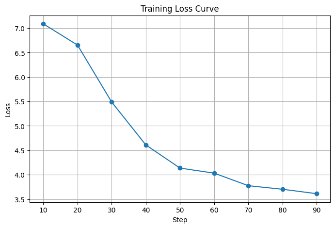

# ChatDOC – Healthcare Assistant Model

Project Overview

ChatDOC is a small instruction-following language model fine-tuned to assist users with healthcare-related queries. It can provide guidance on appointments, hospital procedures, lab results, and general healthcare FAQs.  
This project demonstrates efficient fine-tuning of small language models using LoRA / PEFT, making training feasible on limited resources like free Google Colab.

------------------

# Dataset Details

- Source: HuggingFace ChatDoctor Dataset
- Samples Used: 1000
- Structure: Instruction-Response pairs
- Preprocessing: 
  - Selected first 1000 samples
  - Converted questions and answers into concise instruction-response pairs
  - Applied tokenization, truncation, and padding for uniform input lengths

---------------------

# Model Details

- Base Model: `google/flan-t5-small`
- Fine-Tuning Method: LoRA / PEFT
- Trainable Parameters: ~1–2% of total (~1.18M / 61M)
- Enhancements / Features:
  - LoRA reduces memory footprint
  - Truncation and padding for stable batch training
  - Fine-tuned model saved for easy inference reuse

-------------------------
## Notebook Link
Since GitHub cannot render this notebook properly, you can open and run it on Google Colab using the following link:  
 [Open Notebook in Colab](https://colab.research.google.com/drive/1iPUP8HUkthctOvQPeQl4yjGvtrpB16az)

# Training Details

| Parameter                  | Value           |
|-----------------------------|----------------|
| Batch Size                  | 8              |
| Learning Rate               | 5e-4           |
| Epochs                      | 3              |
| Max Input Tokens            | 256            |
| Max Output Tokens           | 50             |
| PEFT Method                 | LoRA           |
| Target Modules (LoRA)       |`q`,`v`,`k`,`o` |
| Lora r / alpha / dropout    | 16 / 16 / 0.1  |

- Training Loss Curve:  


- Notes:
  - Repetition penalty and temperature adjustments were applied to reduce output duplication.
  - `max_new_tokens` used to control output length.


------------------------------------

# Evaluation

# Example Prompts and Outputs

| Prompt | Base Model Output | Fine-Tuned Output |
|--------|-----------------|-----------------|
| How to schedule a doctor appointment? | Schedule your appointment online or via the hospital desk. | You can schedule a doctor appointment through the hospital portal or by calling the appointment desk. |
| What are the visiting hours for the hospital? | Hospital visiting hours are from 8 AM to 8 PM. | Visiting hours are typically 8 AM to 6 PM; please check the hospital's policy. |
| How can I get my lab test results? | Get a sample of your lab test results. | You can access your lab test results online through the hospital portal or request them at the lab desk. |

 # outputs are saved in `sample_outputs.txt`.*

- Analysis:  
  - The fine-tuned model provides more concise, accurate, and domain-specific responses.
  - Base model often produces generic or repetitive answers.

---------------------------

# Explanation

1. Why this model was chosen:
 Google/flan-t5-small is a small instruction-following language model suitable for fine-tuning on free-tier Google Colab. It balances performance, efficiency, and accessibility, enabling realistic healthcare assistant responses without requiring large GPU resources. Its pretraining on instruction-based tasks also makes it easier to adapt to domain-specific datasets.

2. Why LoRA / PEFT was used:

- LoRA allows us to fine tune only a small subset of model parameters (1–2%) instead of full fine tuning, reducing memory and compute  requirements.
- PEFT ensures that the model adapts to the new dataset while keeping the base model weights frozen.
- This combination makes training feasible on small GPUs / free Colab while still improving domain-specific responses.

3. Challenges faced:

- Session disconnections on Colab interrupted long training runs, requiring saving checkpoints frequently.
- The dataset required formatting into instruction-response pairs, and understanding the ChatDoctor dataset structure was necessary.
- Some prompts caused repetitive outputs, which was mitigated by adjusting generation parameters (e.g., repetition_penalty, temperature, top_p).
- Limited compute prevented extensive hyperparameter tuning, affecting output accuracy on some complex prompts.

4. Future improvements with more time / compute:

- Increase dataset size beyond 1000 samples to improve fine-tuned model performance.
- Hyperparameter tuning: Adjust learning rate, batch size, LoRA ranks, and dropout to reduce output repetition and increase accuracy.
- Experiment with larger base models (e.g., google/flan-t5-base) if more compute is available.
- Implement RAG (Retrieval-Augmented Generation) for handling queries that require external knowledge.
- Add post-processing and prompt engineering to improve response clarity and safety.

-------------------------------------------------

# How to Run 

1. **Clone the repository**
```bash
git clone <repository_url>
cd ChatDOC
```

2. **Install dependencies**
```bash
pip install -r requirements.txt
```

3. **Load the fine-tuned model**
```python
from transformers import AutoTokenizer, AutoModelForSeq2SeqLM
from peft import PeftModel

tokenizer = AutoTokenizer.from_pretrained("google/flan-t5-small")
base_model = AutoModelForSeq2SeqLM.from_pretrained("google/flan-t5-small")
fine_model = PeftModel.from_pretrained(base_model, "./ChatDOC_model")
```

4. **Generate responses**
```python
prompt = "How to schedule a doctor appointment?"
inputs = tokenizer(prompt, return_tensors="pt")
output_ids = fine_model.generate(**inputs, max_new_tokens=50)
response = tokenizer.decode(output_ids[0], skip_special_tokens=True)
print(response)
```

----------------------

# Extra Enhancements

- LoRA fine-tuning for reduced memory and faster training
- Repetition penalty to improve response diversity
- Early stopping to avoid overfitting
- Saved model allows offline inference without retraining

----------------------

# Deliverables

- **Training Notebook:** `ChatDOC_training.ipynb`
- **Dataset:** `chatdoc.json`
- **Fine-Tuned Model:** `./ChatDOC_model`
- **Sample Outputs:** `sample_outputs.txt`
- **Training Loss Curve:** `training_loss_curve.png`

-----------------------

# Acknowledgments

- Dataset: [ChatDoctor Dataset](https://huggingface.co/datasets/allenai/chatdoctor)
- Base Model: [Flan-T5 Small](https://huggingface.co/google/flan-t5-small)
- LoRA / PEFT implementation from HuggingFace
